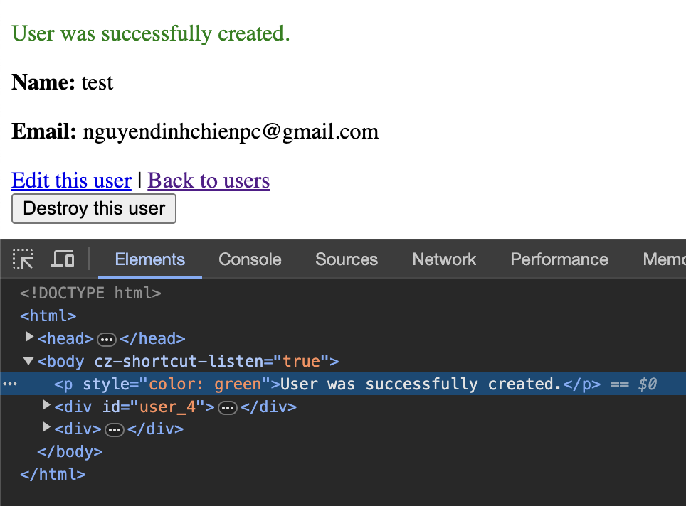
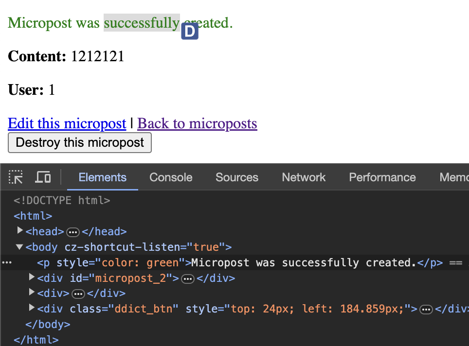
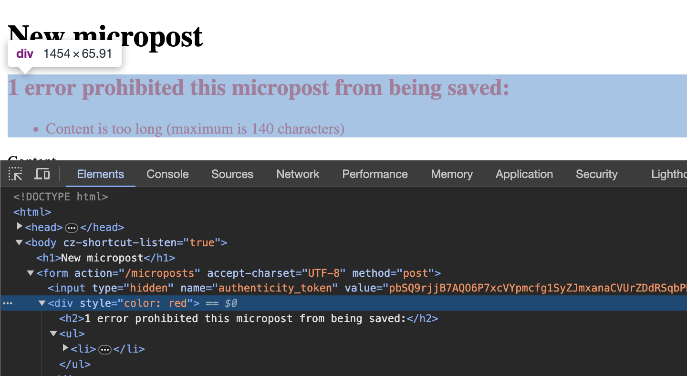

Exercises

** 1.2 ** 

1. According to the default Rails page, what is the version of Ruby on your
system? Confirm by running ruby -v at the command line

- The version of Ruby on my system is ruby 3.2.2.

2. What is the version of Rails? Confirm that it matches the version installed in Listing 1.2.

- The version of Rails on my system is Rails 7.1.2

** 1.3 ** 

1. Change the content of the hello action in Listing 1.9 to read “hola, mundo!” instead of “hello, world!”.

```
render html: "hola, mundo!"
```

2. Show that Rails supports non-ASCII characters by including an inverted
exclamation point, as in “¡Hola, mundo!” (Figure 1.18).14 To get a ¡
character on a Mac, you can use Option-1; otherwise, you can always
copy-and-paste the character into your editor.
git
```
render html: "¡Hola, mundo!"
```
3. By following the example of the hello action in Listing 1.9, add a second action called goodbye that renders the text “goodbye, world!”. Edit
the routes file from Listing 1.11 so that the root route goes to goodbye
instead of to hello (Figure 1.19).

```
render html: "goodbye, world"
```

router.rb
```
application#goodbye
```

** 1.4 **
Cant deploy to Heroku

** 1.5 **
Cant deploy to Heroku


** 2.1 **
1. (For readers who know CSS) Create a new user, then use your browser’s
HTML inspector to determine the CSS id for the text “User was successfully created.” What happens when you refresh your browser?
- There is no CSS ID for the text 'User was successfully created.'. When you refresh the browser, the text goes away.


2. What happens if you try to create a user with a name but no email address?
- When you try to create a user with a name but no email address, user the user is still being created normally.

3. What happens if you try create a user with an invalid email address, like "@example.com”?
- When you try to create a user with a name but no email address, user the user is still being created normally.

4. Destroy each of the users created in the previous exercises. Does Rails display a message by default when a user is destroyed?
- Rails displays "User was successfully destroyed." when a user is destroyed.

** 2.2 **
1. By referring to Figure 2.11, write out the analogous steps for visiting the URL /users/1/edit.

Step 1: The browser issues a request for the /users/1/edit URL.
Step 2: Rails routes /users/1/edit to the edit action in the Users controller.
Step 3: The edit action asks the User model to retrieve the user with an id of 1 (User.find(params[:id])).
Step 4: The User model pulls the specified user from the database.
Step 5: The User model returns the single users to the controller.
Step 6: The controller captures the user in the @user variable, which is passed to the edit view.
Step 7: The view uses embedded Ruby to render the page as HTML.
Step 8: The controller passes the HTML back to the browser.

2. Find the line in the scaffolding code that retrieves the user from the database in the previous exercise. Hint: It’s in a special location called set_user.

- Line: @user = User.find(params[:id]).

3. What is the name of the view file for the user edit page?

- edit.html.erb

** 2.3 **
1. (For readers who know CSS) Create a new micropost, then use your browser’s HTML inspector to determine the CSS id for the text“Micropost was successfully created.” What happens when you refresh you browser?

- There is no CSS ID for the text 'Micropost was successfully created.'. When you refresh the browser, the text goes away.


2. Try to create a micropost with empty content and no user id.

- Successfully create a micropost with empty content and no user id.

3. Try to create a micropost with over 140 characters of content (say, the
first paragraph from the Wikipedia article on Ruby).

- The micropost with the content length set to over 140 characters successfully creates.

4. Destroy the microposts from the previous exercises.

- Successfully destroy a micropost.

** 2.4 **

1. Try to create a micropost with the same long content used in a previous exercise (Section 2.3.1). How has the behavior changed?

- Creating a micropost fails and triggers a validation error if the content length exceeds 140 characters.


2. (For readers who know CSS) Use your browser’s HTML inspector to determine the CSS id of the error message produced by the previous exercise.

- There is no CSS ID for error message.


** 2.5 **

1. Edit the user show page to display the content of the user’s first micropost.
(Use your technical sophistication (Box 1.2) to guess the syntax based on
the other content in the file.) Confirm by visiting /users/1 that it worked.

```
<p>First Micropost</p>
<%= @user.microposts.first.content %>
```

2. The code in Listing 2.18 shows how to add a validation for the presence
of micropost content in order to ensure that microposts can’t be blank.
Verify that you get the behavior shown in Figure 2.17.

- The validation error message displayed "Content can't be blank."

3. Update Listing 2.19 by replacing FILL_IN with the appropriate code to
validate the presence of name and email attributes in the User model (Figure 2.18).

```
class User < ApplicationRecord
  has_many :microposts
  validates :name, presence: true
  validates :email, presence: true
end
```

** 2.6 **
1. By examining the contents of the Application controller file, find the
line that causes ApplicationController to inherit from ActionController::Base.

```
    class ApplicationController < ActionController::Base.
```

2. Is there an analogous file containing a line where ApplicationRecord
inherits from ActiveRecord::Base? Hint: It would probably be a file
called something like application_record.rb in the app/models
directory.

In app/models/application_record.rb:

```
class ApplicationRecord < ActiveRecord::Base
  primary_abstract_class
end
```

** 2.7 **
Cant deploy now

